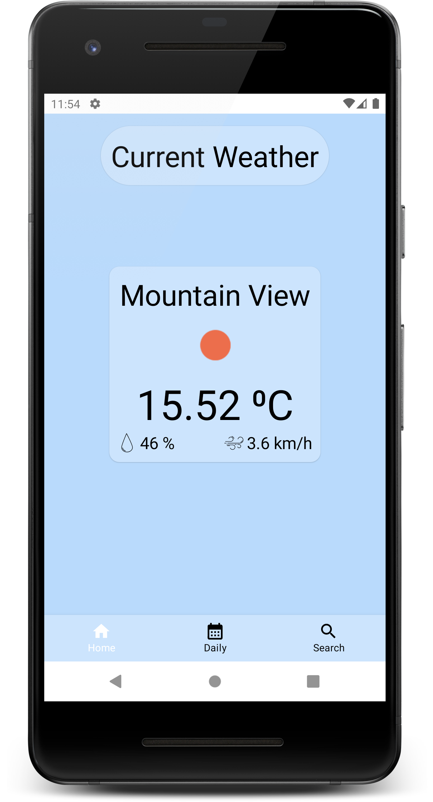
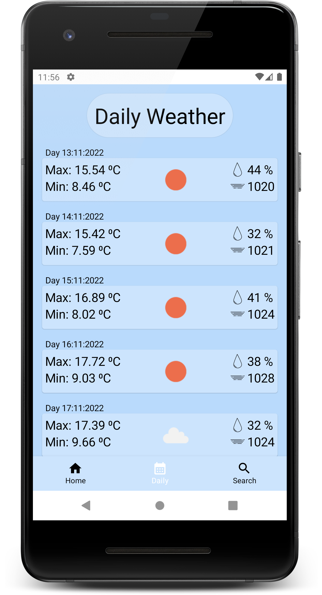
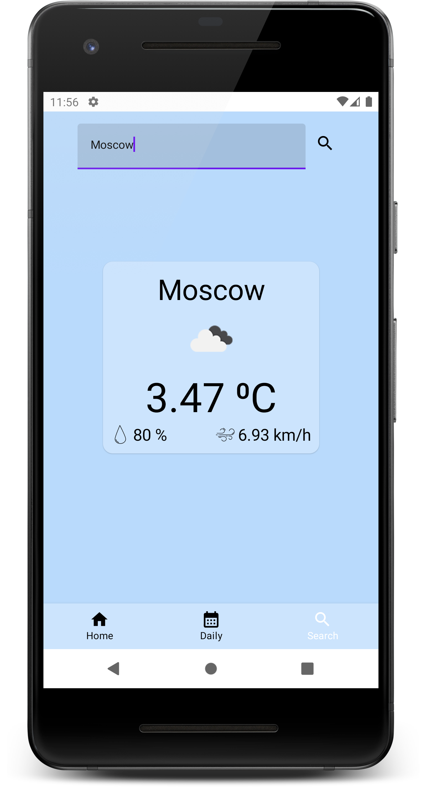

## WeatherAppCompose
### Задача
1.  Отображение прогноза погоды за текущий день
2.  Отображение прогноза погоды за неделю
3.  Возможность увидеть прогноз погоды в текущем городе
4.  Возможность выбрать любой другой город, и узнать прогноз погоды в нем

Для получения информации используется API  OpenWeatherMap

### Стек
* Hilt
* Retrofit
* Coroutines
* LiveData
* Accompanist
* Jetpack Compose Navigation
* Glide for compose
### Структура проекта
* Data 
    * models - data классы преобразованные из классов DTO, для использования в приложении
    * modelsDTO - data классы получаемы при запросе в сеть
    * network - Api для запросов. Mapper - мапинг классов из DTO
    * GPS, используется для поиска местоположения пользователя
* DI - Зависимости 
* UI
    * navigation - Дерево навигаций и bottomNavigation
    * screens
        * components - Переиспользуемые компоненты экрана
            * Extension - Расширения для Compose функций 
        * daily - Экран, отображеня погоды за неделю
        * home - Главный экран, отображение погоды в текущем городе
        * search - Экран поиска в любом городе
### Скриншоты приложения

|  |  |  |
|:------------------------------------------------:|:------------------------------------------------:|:------------------------------------------------:|
